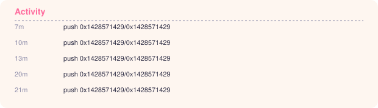
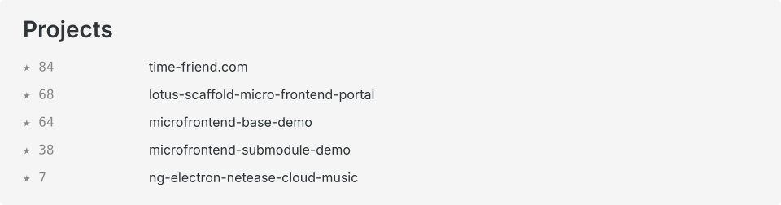

<a href="https://github.com/0x1428571429" target="_blank">
  <picture>
    <source media="(prefers-color-scheme: dark)" srcset="header.dark.svg">
    
  </picture>
</a>
<a href="https://time-friend.com/en/" target="_blank">
  <picture>
    <source media="(prefers-color-scheme: dark)" srcset="blog.dark.svg">
    
  </picture>
</a>
<a href="https://github.com/0x1428571429?tab=stars" target="_blank">
  <picture>
    <source media="(prefers-color-scheme: dark)" srcset="activity.dark.svg">
    
  </picture>
</a>
<a href="https://github.com/0x1428571429?tab=repositories" target="_blank">
  <picture>
    <source media="(prefers-color-scheme: dark)" srcset="project.dark.svg">
    
  </picture>
</a>
