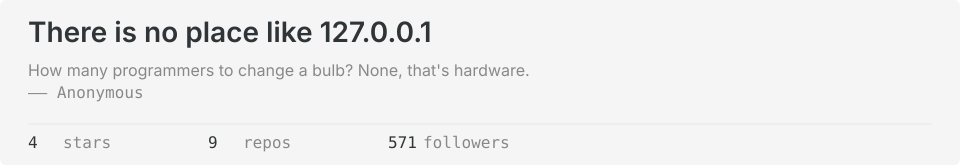
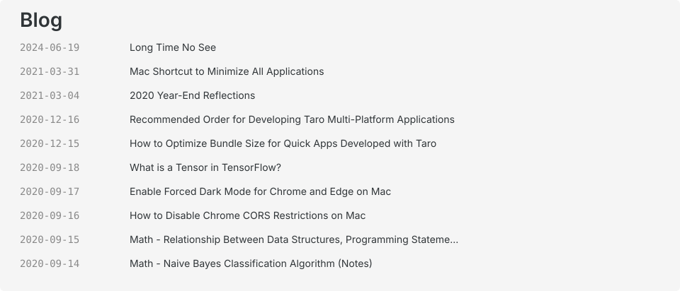

<picture>
  <source media="(prefers-color-scheme: dark)" srcset="header.dark.svg">
  
</picture>

<picture>
  <source media="(prefers-color-scheme: dark)" srcset="blog.dark.svg">
  
</picture>

  

