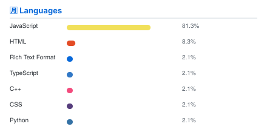

<picture>
  <source media="(prefers-color-scheme: dark)" srcset="header.dark.svg">
  
</picture>

 

<table>
  <tr>
    <td width="50%" align="center" valign="top">
      <picture>
        <source media="(prefers-color-scheme: dark)" srcset="blog.dark.svg">
        
      </picture>
    </td>
    <td width="50%" align="center" valign="top">
      <picture>
        <source media="(prefers-color-scheme: dark)" srcset="languages.dark.svg">
        
      </picture>
    </td>
  </tr>
</table>

<picture>
  <source media="(prefers-color-scheme: dark)" srcset="activity.dark.svg">
  
</picture>

 

  

